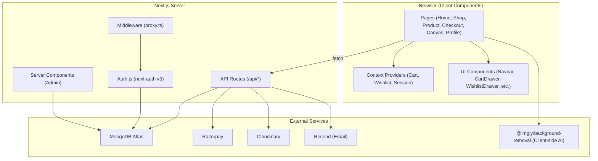
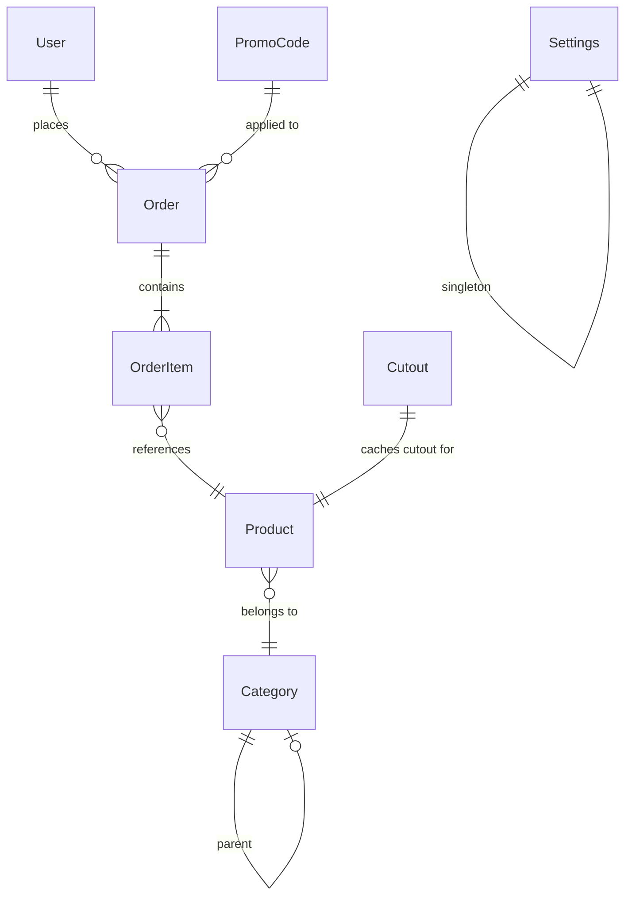
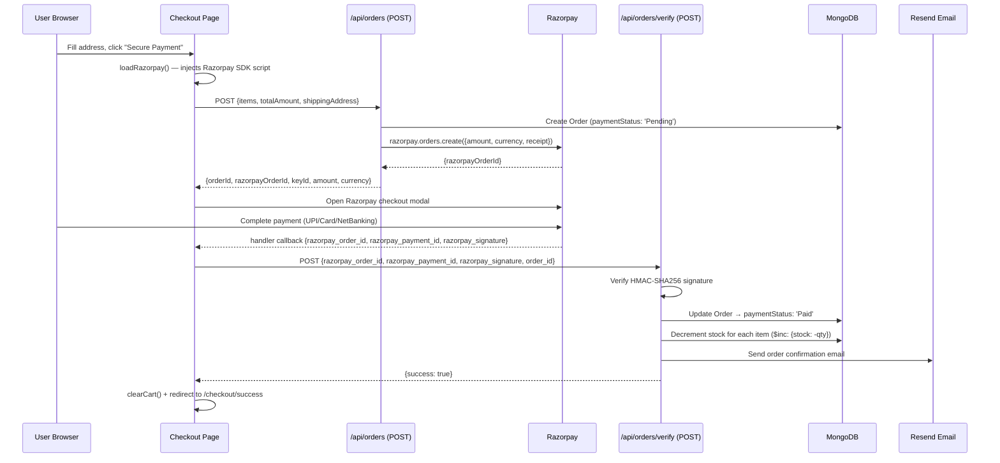
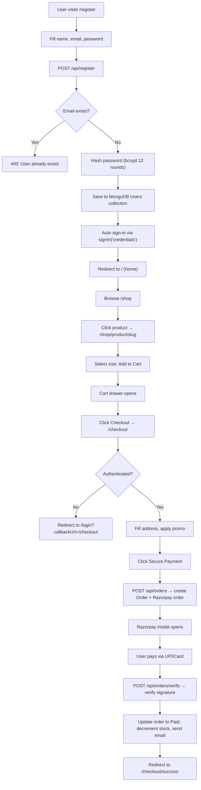
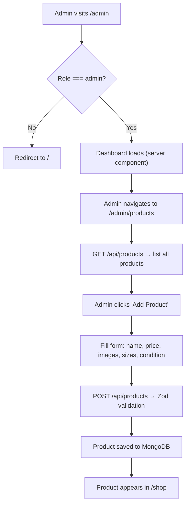

# Calotes Vintage — Code Ownership & Production Deployment Report

> **Project**: Calotes Vintage — India's premium pre-owned vintage & streetwear e-commerce platform
> **Framework**: Next.js 16 (App Router) · TypeScript · MongoDB/Mongoose · Tailwind CSS v4
> **Generated**: June 28, 2026

---

## Table of Contents

1. [Project Identity](#1-project-identity)
2. [Architecture Overview](#2-architecture-overview)
3. [File-by-File Breakdown](#3-file-by-file-breakdown)
4. [Database Design](#4-database-design)
5. [Authentication System](#5-authentication-system)
6. [API Layer](#6-api-layer)
7. [Payment Flow (Razorpay)](#7-payment-flow-razorpay)
8. [Email System (Resend)](#8-email-system-resend)
9. [Image Hosting (Cloudinary)](#9-image-hosting-cloudinary)
10. [AI Background Removal](#10-ai-background-removal)
11. [Client-Side State Management](#11-client-side-state-management)
12. [Component Architecture](#12-component-architecture)
13. [Page-by-Page Routing Map](#13-page-by-page-routing-map)
14. [Admin Dashboard](#14-admin-dashboard)
15. [Middleware & Security](#15-middleware--security)
16. [Styling System](#16-styling-system)
17. [SEO Implementation](#17-seo-implementation)
18. [TypeScript Types](#18-typescript-types)
19. [Environment Variables](#19-environment-variables)
20. [Build & Tooling Configuration](#20-build--tooling-configuration)
21. [Deployment Strategy](#21-deployment-strategy)
22. [Data Flow Diagrams](#22-data-flow-diagrams)
23. [Security Audit & Risks](#23-security-audit--risks)
24. [Performance Analysis](#24-performance-analysis)
25. [Production Readiness Checklist](#25-production-readiness-checklist)
26. [Known Bugs & Debt](#26-known-bugs--debt)
27. [Testing Strategy](#27-testing-strategy)
28. [1-Month Learning Roadmap](#28-1-month-learning-roadmap)

---

## 1. Project Identity

**What it is**: Calotes Vintage is a full-stack e-commerce web application for selling curated, authenticated pre-owned vintage clothing and streetwear in India.

**What problem it solves**: It provides a premium online storefront for a vintage clothing resale business — handling product catalog browsing, shopping cart, checkout with real payments (Razorpay), user authentication, order management, an admin dashboard, and a unique "Fit Canvas" feature that lets users drag-and-drop clothing items to style outfits with AI-powered background removal.

**App type**: Full-stack monolith (frontend + backend in one Next.js application).

**Router**: Next.js **App Router** (all routes under [src/app/](file:///c:/Users/arpit/calotes/src/app)).

**Language**: **TypeScript** end-to-end (`.ts` and `.tsx` files). No JavaScript files.

**Rendering model**:
- **Server Components**: Used in [admin/page.tsx](file:///c:/Users/arpit/calotes/src/app/admin/page.tsx) (fetches DB stats server-side), [admin/layout.tsx](file:///c:/Users/arpit/calotes/src/app/admin/layout.tsx) (server-side auth check), [shop/layout.tsx](file:///c:/Users/arpit/calotes/src/app/shop/layout.tsx) (metadata export), and [layout.tsx](file:///c:/Users/arpit/calotes/src/app/layout.tsx) (root layout with font loading and settings).
- **Client Components**: All user-facing pages (`page.tsx`, `"use client"`) — home, shop, product detail, checkout, canvas, profile, login, register.
- **Server Actions**: Not used. The project uses traditional API routes (`src/app/api/`) for all server-side logic.
- **API Routes**: 15+ route handlers in [src/app/api/](file:///c:/Users/arpit/calotes/src/app/api) covering products, orders, registration, promo codes, settings, categories, emails, and cutout caching.

---

## 2. Architecture Overview



**Key architectural decisions**:
1. **Client-heavy rendering**: Almost all pages use `"use client"` and fetch data via `useEffect` + `fetch()`. This means the app is essentially a client-side SPA that uses Next.js API routes as its backend. SEO-critical product pages are NOT server-rendered.
2. **Mongoose ODM**: All database access goes through Mongoose models, with a shared [connectDB()](file:///c:/Users/arpit/calotes/src/lib/db.ts) connection helper.
3. **Auth.js v5**: Authentication uses the latest Auth.js (next-auth v5) with JWT strategy, Credentials provider (email/password with bcryptjs), and Google OAuth.
4. **Cart & Wishlist in localStorage**: Cart and wishlist are fully client-side via React Context + localStorage. They are NOT persisted to the database.

---

## 3. File-by-File Breakdown

### Root Configuration Files

| File | Purpose |
|------|---------|
| [package.json](file:///c:/Users/arpit/calotes/package.json) | Dependencies, scripts (`dev`, `build`, `start`, `lint`) |
| [next.config.ts](file:///c:/Users/arpit/calotes/next.config.ts) | Image domain allowlist (Unsplash, Cloudinary, Pixabay, Mixkit) |
| [tsconfig.json](file:///c:/Users/arpit/calotes/tsconfig.json) | TypeScript config with `@/` path alias pointing to `./src/` |
| [postcss.config.mjs](file:///c:/Users/arpit/calotes/postcss.config.mjs) | PostCSS with `@tailwindcss/postcss` plugin (Tailwind v4) |
| [eslint.config.mjs](file:///c:/Users/arpit/calotes/eslint.config.mjs) | ESLint flat config with Next.js core-web-vitals + TypeScript |
| [.env.example](file:///c:/Users/arpit/calotes/.env.example) | Template for all required environment variables |

### Core Application Files

| File | Purpose |
|------|---------|
| [src/auth.ts](file:///c:/Users/arpit/calotes/src/auth.ts) | Main Auth.js configuration — Credentials + Google providers, JWT callbacks, MongoDBAdapter |
| [src/auth.config.ts](file:///c:/Users/arpit/calotes/src/auth.config.ts) | Edge-compatible auth config (route matchers for middleware) |
| [src/proxy.ts](file:///c:/Users/arpit/calotes/src/proxy.ts) | Middleware — in-memory rate limiting, admin route protection, bot blocking |
| [src/lib/db.ts](file:///c:/Users/arpit/calotes/src/lib/db.ts) | Mongoose connection singleton with `globalThis` caching for HMR |
| [src/lib/mongodb.ts](file:///c:/Users/arpit/calotes/src/lib/mongodb.ts) | Raw MongoClient singleton for the Auth.js MongoDBAdapter |
| [src/lib/cloudinary.ts](file:///c:/Users/arpit/calotes/src/lib/cloudinary.ts) | Cloudinary SDK configuration |
| [src/lib/sendEmail.ts](file:///c:/Users/arpit/calotes/src/lib/sendEmail.ts) | Resend email helper with HTML template builder |
| [src/types/index.ts](file:///c:/Users/arpit/calotes/src/types/index.ts) | Shared TypeScript interfaces (Product, Order, User, Category, Promo, StoreSettings) |

---

## 4. Database Design

The application uses **MongoDB** via **Mongoose** with 7 models. Here is the complete schema map:

### [Product](file:///c:/Users/arpit/calotes/src/models/Product.ts)
```
{
  name: String (required, trimmed)
  slug: String (required, unique, lowercase)
  description: String (required)
  price: Number (required, min: 0)
  compareAtPrice: Number (optional — for showing "was ₹X" strikethrough)
  images: [String] (required, min: 1 — Cloudinary URLs)
  category: ObjectId → Category (ref, required)
  brand: String (required)
  condition: Enum ['Excellent', 'Great', 'Good', 'Fair'] (required)
  sizes: [String] (default: [])
  sku: String (optional)
  stock: Number (default: 1, min: 0)
  isFeatured: Boolean (default: false)
  measurements: { pitToPit, length, waist } (all optional Strings)
  tags: [String]
  status: Enum ['active', 'draft', 'archived'] (default: 'active')
}
```

> [!IMPORTANT]
> The `stock` field defaults to `1` because each vintage piece is typically unique (one-of-one). When a product sells, the [verify API](file:///c:/Users/arpit/calotes/src/app/api/orders/verify/route.ts) decrements stock with `$inc: { stock: -quantity }`. There is **no atomicity guard** — if two users pay simultaneously, both could succeed and stock could go negative.

### [User](file:///c:/Users/arpit/calotes/src/models/User.ts)
```
{
  name: String (required)
  email: String (required, unique, lowercase)
  password: String (optional — blank for Google OAuth users)
  role: Enum ['customer', 'admin'] (default: 'customer')
  avatar: String (optional)
}
```

### [Order](file:///c:/Users/arpit/calotes/src/models/Order.ts)
```
{
  user: ObjectId → User (optional — guest checkout possible)
  items: [{
    product: ObjectId → Product
    name, size, quantity, price, image: String/Number
  }]
  shippingAddress: { fullName, street, city, state, postalCode, country, phone }
  paymentMethod: String (default: 'razorpay')
  paymentStatus: Enum ['Pending', 'Paid', 'Failed', 'Refunded']
  orderStatus: Enum ['Processing', 'Shipped', 'Delivered', 'Cancelled']
  totalAmount, shippingPrice, discountAmount: Number
  promoCode: String (optional)
  razorpayOrderId, razorpayPaymentId: String
}
```

### [Category](file:///c:/Users/arpit/calotes/src/models/Category.ts)
```
{
  name: String (required, unique, trimmed)
  slug: String (required, unique, lowercase)
  description: String (optional)
  parent: ObjectId → Category (optional — self-referencing for nesting)
}
```

### [PromoCode](file:///c:/Users/arpit/calotes/src/models/PromoCode.ts)
```
{
  code: String (required, unique, uppercase, trimmed)
  discountType: Enum ['percentage', 'flat']
  discountValue: Number (required, min: 0)
  minOrderAmount: Number (default: 0)
  maxDiscountAmount: Number (optional — caps percentage discounts)
  isActive: Boolean (default: true)
  expiresAt: Date (optional)
  usageLimit: Number (optional)
  usageCount: Number (default: 0)
}
```

### [Settings](file:///c:/Users/arpit/calotes/src/models/Settings.ts)
```
{
  storeName: 'Calotes Vintage'
  tagline, description, contactEmail, supportPhone: String
  freeShippingThreshold: Number (default: 2999)
  shippingFlatRate: Number (default: 149)
  featuredPromoCode: String (optional)
  socialLinks: { instagram, whatsapp }
}
```

### [Cutout](file:///c:/Users/arpit/calotes/src/models/Cutout.ts)
```
{
  productId: ObjectId → Product (required, unique)
  originalUrl: String (required)
  cutoutUrl: String (required — Cloudinary URL of the transparent PNG)
}
```

> [!NOTE]
> The `Cutout` model is an optimization cache. When the "Fit Canvas" AI removes a product image's background, the transparent PNG is uploaded to Cloudinary and its URL is cached in this collection. This way, subsequent users get the cutout instantly instead of re-running AI inference.

### Entity Relationship Diagram



---

## 5. Authentication System

### Files Involved

| File | Role |
|------|------|
| [src/auth.ts](file:///c:/Users/arpit/calotes/src/auth.ts) | Core auth configuration (providers, callbacks, adapter) |
| [src/auth.config.ts](file:///c:/Users/arpit/calotes/src/auth.config.ts) | Edge-compatible auth config for middleware |
| [src/proxy.ts](file:///c:/Users/arpit/calotes/src/proxy.ts) | Middleware that runs on every request |
| [src/app/api/auth/[...nextauth]/route.ts](file:///c:/Users/arpit/calotes/src/app/api/auth/%5B...nextauth%5D/route.ts) | NextAuth catch-all route handler |
| [src/app/api/register/route.ts](file:///c:/Users/arpit/calotes/src/app/api/register/route.ts) | User registration endpoint |
| [src/app/(auth)/login/page.tsx](file:///c:/Users/arpit/calotes/src/app/(auth)/login/page.tsx) | Login UI |
| [src/app/(auth)/register/page.tsx](file:///c:/Users/arpit/calotes/src/app/(auth)/register/page.tsx) | Registration UI |

### How It Works

**Strategy**: JWT-based sessions (no database sessions). The JWT token stores `id`, `role`, `name`, and `email`.

**Providers**:
1. **Credentials** — Email + password login. The `authorize` function in [auth.ts](file:///c:/Users/arpit/calotes/src/auth.ts#L17-L37) connects to MongoDB, finds the user, compares the password hash via `bcryptjs.compare()`, and returns the user object.
2. **Google OAuth** — Uses `GOOGLE_CLIENT_ID` and `GOOGLE_CLIENT_SECRET`. New Google users are auto-created via the `MongoDBAdapter`.

**Callbacks**:
- `jwt` callback (L40-L58): On first sign-in, it looks up the user in the DB to attach `role` and `id` to the JWT. On subsequent requests, it reads from the existing token.
- `session` callback (L59-L68): Copies `role` and `id` from the JWT token into the `session.user` object so client components can access them via `useSession()`.

**Registration Flow** ([src/app/api/register/route.ts](file:///c:/Users/arpit/calotes/src/app/api/register/route.ts)):
1. POST receives `{ name, email, password }`.
2. Validates input with Zod schema (name 2-50 chars, valid email, password 6+ chars).
3. Checks for existing user → returns 400 if found.
4. Hashes password with `bcryptjs.hash(password, 12)` (12 salt rounds).
5. Creates user in MongoDB → returns 201.
6. The [register page](file:///c:/Users/arpit/calotes/src/app/(auth)/register/page.tsx#L41-L48) then auto-signs-in with `signIn("credentials", ...)` and redirects to `/`.

> [!WARNING]
> **No email verification**: Users can register with any email address. There's no verification step. In production, add email verification before allowing purchases.

> [!WARNING]
> **No password reset**: There is no "forgot password" flow. You need to build one.

---

## 6. API Layer

All API routes are in [src/app/api/](file:///c:/Users/arpit/calotes/src/app/api). Here's the complete map:

### Product APIs

| Endpoint | Method | Auth | File | Description |
|----------|--------|------|------|-------------|
| `/api/products` | GET | Public | [route.ts](file:///c:/Users/arpit/calotes/src/app/api/products/route.ts) | Lists products. Supports `?category=slug`, `?slug=slug`, and `?q=searchTerm` query params. Populates category. |
| `/api/products` | POST | Admin | [route.ts](file:///c:/Users/arpit/calotes/src/app/api/products/route.ts) | Creates a new product. Validates via Zod. Auto-generates slug from name if not provided. |
| `/api/products/[id]` | GET | Public | [route.ts](file:///c:/Users/arpit/calotes/src/app/api/products/%5Bid%5D/route.ts) | Fetches single product by MongoDB `_id`. |
| `/api/products/[id]` | PUT | Admin | [route.ts](file:///c:/Users/arpit/calotes/src/app/api/products/%5Bid%5D/route.ts) | Updates product by `_id`. |
| `/api/products/[id]` | DELETE | Admin | [route.ts](file:///c:/Users/arpit/calotes/src/app/api/products/%5Bid%5D/route.ts) | Deletes product by `_id`. |

**Search implementation** ([products route.ts L26-L39](file:///c:/Users/arpit/calotes/src/app/api/products/route.ts#L26-L39)):
Uses MongoDB `$regex` on `name`, `brand`, `description`, and `tags` fields with case-insensitive matching. This is NOT a full-text search index — it will be slow on large datasets.

### Order APIs

| Endpoint | Method | Auth | File | Description |
|----------|--------|------|------|-------------|
| `/api/orders` | GET | Admin | [route.ts](file:///c:/Users/arpit/calotes/src/app/api/orders/route.ts) | Lists all orders (admin dashboard). Populates `user` field. |
| `/api/orders` | POST | Authenticated | [route.ts](file:///c:/Users/arpit/calotes/src/app/api/orders/route.ts) | Creates order + Razorpay order. Returns `razorpayOrderId`, `keyId`, `amount`. |
| `/api/orders/verify` | POST | Authenticated | [verify/route.ts](file:///c:/Users/arpit/calotes/src/app/api/orders/verify/route.ts) | Verifies Razorpay payment signature. Updates order to "Paid". Decrements stock. Sends email. |
| `/api/orders/user` | GET | Authenticated | [user/route.ts](file:///c:/Users/arpit/calotes/src/app/api/orders/user/route.ts) | Returns current user's orders (for profile page). |
| `/api/orders/[id]` | GET | Authenticated | [[id]/route.ts](file:///c:/Users/arpit/calotes/src/app/api/orders/%5Bid%5D/route.ts) | Fetches single order by `_id` (for success page). |
| `/api/orders/[id]` | PUT | Admin | [[id]/route.ts](file:///c:/Users/arpit/calotes/src/app/api/orders/%5Bid%5D/route.ts) | Updates order status (admin). |

### Other APIs

| Endpoint | Method | Auth | File | Description |
|----------|--------|------|------|-------------|
| `/api/register` | POST | Public | [route.ts](file:///c:/Users/arpit/calotes/src/app/api/register/route.ts) | User registration |
| `/api/categories` | GET/POST | GET: Public, POST: Admin | [route.ts](file:///c:/Users/arpit/calotes/src/app/api/categories/route.ts) | Category CRUD |
| `/api/categories/[id]` | PUT/DELETE | Admin | [[id]/route.ts](file:///c:/Users/arpit/calotes/src/app/api/categories/%5Bid%5D/route.ts) | Category update/delete |
| `/api/promo/validate` | POST | Public | [validate/route.ts](file:///c:/Users/arpit/calotes/src/app/api/promo/validate/route.ts) | Validates coupon code, returns discount amount |
| `/api/promo` | GET/POST | Admin | [route.ts](file:///c:/Users/arpit/calotes/src/app/api/promo/route.ts) | Promo code CRUD |
| `/api/settings` | GET/PUT | GET: Public, PUT: Admin | [route.ts](file:///c:/Users/arpit/calotes/src/app/settings/route.ts) | Store settings (singleton) |
| `/api/cutout` | GET/POST | Public | [route.ts](file:///c:/Users/arpit/calotes/src/app/api/cutout/route.ts) | AI cutout cache (GET: all cached cutouts, POST: save new cutout) |
| `/api/send-email` | POST | Authenticated | [route.ts](file:///c:/Users/arpit/calotes/src/app/api/send-email/route.ts) | Sends transactional email via Resend |

---

## 7. Payment Flow (Razorpay)

This is the most critical production flow. Here is the exact sequence:



### Code Locations

1. **Order creation**: [src/app/api/orders/route.ts](file:///c:/Users/arpit/calotes/src/app/api/orders/route.ts#L42-L88) — The POST handler creates a MongoDB order document first, then creates a Razorpay order, and returns both IDs.

2. **Payment verification**: [src/app/api/orders/verify/route.ts](file:///c:/Users/arpit/calotes/src/app/api/orders/verify/route.ts) — Uses `crypto.createHmac('sha256', secret)` to verify the Razorpay signature. This is the security-critical step that ensures the payment was not spoofed.

3. **Client-side Razorpay integration**: [src/app/checkout/page.tsx](file:///c:/Users/arpit/calotes/src/app/checkout/page.tsx#L32-L115) — Dynamically loads the Razorpay script, creates payment options, and opens the checkout modal.

> [!CAUTION]
> **Critical security gap**: The `totalAmount` is sent from the client in the POST to `/api/orders`. A malicious user could modify this value to pay less. The server should **recalculate** the total from the item prices in the database, not trust the client-sent value. This is the **#1 security fix** needed before going to production.

> [!WARNING]
> **Stock race condition**: Stock is decremented in the verify handler (`Product.findByIdAndUpdate(item.product, { $inc: { stock: -item.quantity } })`). There's no check that stock is still > 0 before decrementing. Two simultaneous successful payments for the same 1-of-1 item could both succeed.

---

## 8. Email System (Resend)

**File**: [src/lib/sendEmail.ts](file:///c:/Users/arpit/calotes/src/lib/sendEmail.ts)

The email helper uses the [Resend](https://resend.com) service. It takes `to`, `subject`, and `html` parameters and sends via `resend.emails.send()`. The `from` address is hardcoded to `Calotes <onboarding@resend.dev>`.

Emails are triggered in two places:
1. **Order confirmation** — After successful payment verification in [verify/route.ts](file:///c:/Users/arpit/calotes/src/app/api/orders/verify/route.ts), an email is sent with order details.
2. **Generic email API** — [/api/send-email](file:///c:/Users/arpit/calotes/src/app/api/send-email/route.ts) exposes a POST endpoint for admin use.

> [!IMPORTANT]
> For production, you **must** configure a custom domain with Resend (e.g., `noreply@calotes.com`) and update the `from` field. The default `onboarding@resend.dev` sender is for testing only and will have deliverability issues.

---

## 9. Image Hosting (Cloudinary)

**File**: [src/lib/cloudinary.ts](file:///c:/Users/arpit/calotes/src/lib/cloudinary.ts)

Cloudinary is configured using `CLOUDINARY_CLOUD_NAME`, `CLOUDINARY_API_KEY`, and `CLOUDINARY_API_SECRET`. It serves two purposes:

1. **Product images**: Product images are stored as Cloudinary URLs in the `images` array of the Product model.
2. **AI cutout cache**: When the Fit Canvas generates a transparent PNG, it's uploaded to Cloudinary via the [/api/cutout POST handler](file:///c:/Users/arpit/calotes/src/app/api/cutout/route.ts) using `cloudinary.uploader.upload(base64Data, { folder: "cutouts" })`.

**Image domains allowed** (in [next.config.ts](file:///c:/Users/arpit/calotes/next.config.ts)):
- `images.unsplash.com` — Stock photos for hero/editorial images
- `res.cloudinary.com` — Product images and AI cutouts
- `assets.mixkit.co` and `cdn.pixabay.com` — Additional stock content

---

## 10. AI Background Removal

This is the "Fit Canvas" feature — one of the most technically interesting parts of the codebase.

**Files**:
- [src/app/canvas/page.tsx](file:///c:/Users/arpit/calotes/src/app/canvas/page.tsx) — The main canvas page
- [src/app/api/cutout/route.ts](file:///c:/Users/arpit/calotes/src/app/api/cutout/route.ts) — Server-side cache API
- [src/models/Cutout.ts](file:///c:/Users/arpit/calotes/src/models/Cutout.ts) — MongoDB cache model

**How it works**:

1. **Model preload**: On page mount, the client preloads the ISNet 8-bit quantized model via `@imgly/background-removal`'s `preload()` ([canvas/page.tsx L76-L79](file:///c:/Users/arpit/calotes/src/app/canvas/page.tsx#L76-L79)).
2. **Cache check**: When adding a product to canvas, it first checks an in-memory JavaScript `Map` for a cached cutout URL.
3. **Server cache**: On mount, all previously cached cutouts are fetched from the server (`GET /api/cutout`) and loaded into the in-memory cache.
4. **AI inference**: If no cache hit, the client-side `removeBackground()` function runs inference using a WASM-based ISNet model in the browser. This takes 2-5 seconds depending on the device.
5. **Cache write**: The resulting transparent PNG blob is:
   - Immediately stored in the in-memory cache as an Object URL (for instant reuse in the same session).
   - Converted to base64 and POSTed to `/api/cutout`, which uploads it to Cloudinary and saves the URL in MongoDB.
6. **Draggable canvas**: Items are rendered as `<motion.div drag>` elements from Framer Motion, allowing drag-and-drop positioning.

**Bundle discount**: If 3+ items are on the canvas, a 10% discount is automatically applied when adding to cart ([canvas/page.tsx L213-L214](file:///c:/Users/arpit/calotes/src/app/canvas/page.tsx#L213-L214)).

> [!WARNING]
> The 10% bundle discount is **client-side only**. There is no server-side validation. A user could add items to cart normally and never use the canvas, or manipulate the discount amount. The discount needs server-side validation.

---

## 11. Client-Side State Management

The app uses **React Context API** with `localStorage` persistence. No Redux, Zustand, or other state libraries.

### [CartContext](file:///c:/Users/arpit/calotes/src/context/CartContext.tsx)

**State**: `items: CartItem[]`, `isCartOpen: boolean`
**Derived**: `cartTotal`, `cartCount`
**Actions**: `addToCart`, `removeFromCart`, `updateQuantity`, `clearCart`
**Persistence**: `localStorage.getItem/setItem("calotes_cart")`

The `addToCart` function is intelligent — if the same product+size combination already exists, it increments the quantity instead of adding a duplicate ([CartContext.tsx L56-L71](file:///c:/Users/arpit/calotes/src/context/CartContext.tsx#L56-L71)).

A `requestAnimationFrame` call wraps the initial state hydration to avoid React 18 hydration mismatches ([CartContext.tsx L34-L43](file:///c:/Users/arpit/calotes/src/context/CartContext.tsx#L34-L43)).

### [WishlistContext](file:///c:/Users/arpit/calotes/src/context/WishlistContext.tsx)

**State**: `items: WishlistItem[]`, `isOpen: boolean`
**Derived**: `count`
**Actions**: `toggleWishlist`, `clearWishlist`, `isInWishlist`
**Persistence**: `localStorage.getItem/setItem("calotes_wishlist")`

The `toggleWishlist` function both adds and removes, with a toast notification ([WishlistContext.tsx L57-L66](file:///c:/Users/arpit/calotes/src/context/WishlistContext.tsx#L57-L66)).

### Provider Composition

All providers are composed in [src/components/Providers.tsx](file:///c:/Users/arpit/calotes/src/components/Providers.tsx):

```tsx
<SessionProvider>      // next-auth session
  <CartProvider>        // shopping cart
    <WishlistProvider>  // wishlist
      {children}
    </WishlistProvider>
  </CartProvider>
</SessionProvider>
```

This is mounted in the [root layout](file:///c:/Users/arpit/calotes/src/app/layout.tsx) wrapping `{children}`.

> [!NOTE]
> **Trade-off**: localStorage-only cart means if a user clears their browser data or switches devices, their cart is gone. For a vintage store with unique items, this is acceptable. For higher-value stores, consider server-side cart persistence tied to the user account.

---

## 12. Component Architecture

All components are in [src/components/](file:///c:/Users/arpit/calotes/src/components). Every single one is a `"use client"` component.

| Component | Size | Purpose |
|-----------|------|---------|
| [Navbar.tsx](file:///c:/Users/arpit/calotes/src/components/Navbar.tsx) | 367 lines | Main navigation bar. Desktop: centered logo, left nav links, right actions. Mobile: icon-only header with full-screen overlay menu. Handles dark/light theme toggle via `localStorage`. Auto-hides on `/admin/*` routes. |
| [CartDrawer.tsx](file:///c:/Users/arpit/calotes/src/components/CartDrawer.tsx) | 106 lines | Slide-in drawer from right. Shows cart items with quantity controls. Checkout button navigates to `/checkout`. |
| [WishlistDrawer.tsx](file:///c:/Users/arpit/calotes/src/components/WishlistDrawer.tsx) | 169 lines | Slide-in drawer from right. Shows wishlist items with "Add to Bag" and "Remove" actions. "Style in Fit Canvas" CTA links to `/canvas`. |
| [Footer.tsx](file:///c:/Users/arpit/calotes/src/components/Footer.tsx) | 127 lines | Site footer with brand column, shop links, info links, social links, newsletter form. Auto-hides on `/admin/*`. |
| [AnnouncementBar.tsx](file:///c:/Users/arpit/calotes/src/components/AnnouncementBar.tsx) | 47 lines | Black marquee bar at top with scrolling promotional text. Dismissible. Auto-hides on `/admin/*`. |
| [WhatsAppButton.tsx](file:///c:/Users/arpit/calotes/src/components/WhatsAppButton.tsx) | 29 lines | Floating action button (bottom-right) linking to WhatsApp with a pre-filled message. Auto-hides on `/admin/*`. |
| [CookieBanner.tsx](file:///c:/Users/arpit/calotes/src/components/CookieBanner.tsx) | 69 lines | Cookie consent banner. Appears after 1.5s delay. Stores consent in `localStorage("cookie-consent")`. |
| [PageTransition.tsx](file:///c:/Users/arpit/calotes/src/components/PageTransition.tsx) | 25 lines | Framer Motion wrapper with fade+slide animation on route changes. Uses `usePathname()` as `key`. |
| [ProductImageSlider.tsx](file:///c:/Users/arpit/calotes/src/components/ProductImageSlider.tsx) | 130 lines | Image carousel for product cards. Supports swipe gestures on mobile via touch events. Arrow navigation. Dot indicators. |
| [PatinaInspector.tsx](file:///c:/Users/arpit/calotes/src/components/PatinaInspector.tsx) | 533 lines | Full-screen modal for product inspection. Desktop: magnifying glass lens that follows cursor. Mobile: tabbed hotspot panel. Animated scan line. Hotspot markers with authenticity narratives. |
| [Logo.tsx](file:///c:/Users/arpit/calotes/src/components/Logo.tsx) | 15 lines | Text-based logo rendering "Calotes" + "Vintage" subtitle. |
| [EmptyState.tsx](file:///c:/Users/arpit/calotes/src/components/EmptyState.tsx) | 66 lines | Reusable empty state for cart, orders, wishlist, search. |
| [Skeleton.tsx](file:///c:/Users/arpit/calotes/src/components/Skeleton.tsx) | 57 lines | Loading skeleton components (ProductGrid, ProductPage, Cart). |
| [Providers.tsx](file:///c:/Users/arpit/calotes/src/components/Providers.tsx) | 16 lines | Provider composition wrapper. |

---

## 13. Page-by-Page Routing Map

### Public Pages

| Route | File | Type | Data Fetching | Description |
|-------|------|------|---------------|-------------|
| `/` | [page.tsx](file:///c:/Users/arpit/calotes/src/app/page.tsx) | Client | `useEffect` → `GET /api/products` + `GET /api/settings` | Hero section, featured products, editorial sections, CTA blocks |
| `/shop` | [shop/page.tsx](file:///c:/Users/arpit/calotes/src/app/shop/page.tsx) | Client | `useEffect` → `GET /api/products?category=...&q=...` | Product grid with category tabs, search bar, sidebar, filter drawer |
| `/shop/product/[slug]` | [product/[slug]/page.tsx](file:///c:/Users/arpit/calotes/src/app/shop/product/%5Bslug%5D/page.tsx) | Client | `useEffect` → `GET /api/products?slug=...` | Product detail with image gallery, size picker, add-to-cart, Patina Inspector, reviews, related products |
| `/canvas` | [canvas/page.tsx](file:///c:/Users/arpit/calotes/src/app/canvas/page.tsx) | Client | `useEffect` → `GET /api/products` + `GET /api/cutout` | Fit Canvas — drag-and-drop outfit builder with AI background removal |
| `/lookbook` | [lookbook/page.tsx](file:///c:/Users/arpit/calotes/src/app/lookbook/page.tsx) | Client | None (static editorial) | Fashion editorial lookbook page |
| `/about` | [about/page.tsx](file:///c:/Users/arpit/calotes/src/app/about/page.tsx) | Client | None (static) | About the brand page |

### Auth Pages (Route Group: `(auth)`)

| Route | File | Type |
|-------|------|------|
| `/login` | [(auth)/login/page.tsx](file:///c:/Users/arpit/calotes/src/app/(auth)/login/page.tsx) | Client — Credentials + Google OAuth login form |
| `/register` | [(auth)/register/page.tsx](file:///c:/Users/arpit/calotes/src/app/(auth)/register/page.tsx) | Client — Registration form with auto-sign-in |

### Protected Pages

| Route | File | Auth Required | Description |
|-------|------|---------------|-------------|
| `/checkout` | [checkout/page.tsx](file:///c:/Users/arpit/calotes/src/app/checkout/page.tsx) | Yes | Address form, order summary, promo codes, Razorpay payment |
| `/checkout/success` | [checkout/success/page.tsx](file:///c:/Users/arpit/calotes/src/app/checkout/success/page.tsx) | No (but shows order data) | Post-payment confirmation with order details |
| `/profile` | [profile/page.tsx](file:///c:/Users/arpit/calotes/src/app/profile/page.tsx) | Yes | User account, order history |

### Admin Pages

| Route | File | Auth Required | Description |
|-------|------|---------------|-------------|
| `/admin` | [admin/page.tsx](file:///c:/Users/arpit/calotes/src/app/admin/page.tsx) | Admin role | Server component — dashboard stats (revenue, orders, products, customers) |
| `/admin/products` | admin/products/page.tsx | Admin role | Product CRUD management |
| `/admin/orders` | admin/orders/page.tsx | Admin role | Order management with status updates |
| `/admin/categories` | admin/categories/page.tsx | Admin role | Category management |
| `/admin/settings` | admin/settings/page.tsx | Admin role | Store configuration |
| `/admin/promo` | admin/promo/page.tsx | Admin role | Promo code management |

---

## 14. Admin Dashboard

### Protection

The admin is protected at two levels:

1. **Layout-level** ([admin/layout.tsx](file:///c:/Users/arpit/calotes/src/app/admin/layout.tsx#L6-L12)): This is a **server component** that calls `auth()` and checks `session.user.role !== "admin"`. Non-admin users are `redirect("/")`'d. This is the primary security gate.

2. **API-level**: Most admin API routes check `session.user.role === "admin"` before allowing mutations.

### Structure

- [AdminSidebar.tsx](file:///c:/Users/arpit/calotes/src/app/admin/AdminSidebar.tsx) — Client component with responsive sidebar. Desktop: sticky left panel. Mobile: hamburger menu with slide-out overlay.
- [AdminNav.tsx](file:///c:/Users/arpit/calotes/src/app/admin/AdminNav.tsx) — Navigation links for admin sections.
- [admin/page.tsx](file:///c:/Users/arpit/calotes/src/app/admin/page.tsx) — Dashboard with 4 stat cards (Revenue, Orders, Products, Customers). Uses `export const dynamic = "force-dynamic"` to prevent caching.

> [!NOTE]
> The admin dashboard page is the **only server component page** in the application. It directly queries MongoDB using Mongoose models.

---

## 15. Middleware & Security

### [src/proxy.ts](file:///c:/Users/arpit/calotes/src/proxy.ts)

This file exports the Next.js middleware. It runs on every request (configured via `config.matcher`). Key behaviors:

1. **Rate Limiting**: In-memory `Map<IP, {count, resetTime}>`. Limits to 100 requests per 60 seconds per IP. Returns 429 if exceeded. 
   > ⚠️ **In-memory rate limiting does not work across multiple serverless instances**. In production on Vercel, each function invocation gets its own memory space. You need a distributed rate limiter (e.g., Upstash Redis).

2. **Bot Blocking**: Checks User-Agent for known bad bots (`curl`, `wget`, `python-requests`).

3. **Admin Route Protection**: For paths starting with `/admin`, it calls `auth()` and checks for admin role.

4. **Auth Route Delegation**: For `/api/auth/*` paths, it delegates to `NextAuth`'s middleware handler.

5. **Route Matching**: The `config.matcher` excludes static assets, images, and Next.js internals.

---

## 16. Styling System

### Technology

- **Tailwind CSS v4** with PostCSS plugin (`@tailwindcss/postcss`)
- Imported via `@import "tailwindcss"` in [globals.css](file:///c:/Users/arpit/calotes/src/app/globals.css#L1)
- Uses Tailwind v4's `@theme` directive for custom CSS variables

### Design Tokens (in [globals.css](file:///c:/Users/arpit/calotes/src/app/globals.css#L3-L20))

**Light mode**:
```css
--color-bg: #FFFFFF
--color-bg-warm: #F9F9F9
--color-text: #0F0A05
--color-muted: #737373
--color-terracotta: #D32F2F  /* Primary accent — red */
--color-border: rgba(0, 0, 0, 0.1)
```

**Dark mode** (`.dark` class on `<html>`):
```css
--color-bg: #0A0A0A
--color-text: #F5F5F5
--color-muted: #A3A3A3
--color-border: rgba(255, 255, 255, 0.1)
```

### Typography

Three font families loaded in [layout.tsx](file:///c:/Users/arpit/calotes/src/app/layout.tsx):
- **Inter** — Body text (`--font-sans`)
- **Barlow** — Display headings (`--font-display`) — heavy, condensed, uppercase
- **Playfair Display** — Serif accents (`--font-serif`) — italic editorial

### Key CSS Classes

| Class | Purpose |
|-------|---------|
| `.btn-primary` | Terracotta filled button → outline on hover |
| `.btn-outline` | Bordered button → filled on hover |
| `.section-label` | 9px uppercase bold tracking-widest muted label |
| `.marquee-track` | Infinite horizontal scroll animation |
| `.underline-hover` | Animated underline on hover |
| `.glossy-btn` | Glassmorphic icon buttons with shine animation |

### Theme Toggling

Dark mode is toggled by adding/removing the `dark` class on `<html>` via JavaScript in [Navbar.tsx](file:///c:/Users/arpit/calotes/src/components/Navbar.tsx#L49-L59). Preference is stored in `localStorage("theme")`.

Additionally, the root [layout.tsx](file:///c:/Users/arpit/calotes/src/app/layout.tsx) fetches the store `Settings` from MongoDB and applies theme settings dynamically via an inline `<script>` tag.

---

## 17. SEO Implementation

| Feature | File | Status |
|---------|------|--------|
| Title + Meta | [layout.tsx](file:///c:/Users/arpit/calotes/src/app/layout.tsx) | ✅ Root metadata with title template `"%s | Calotes Vintage"` |
| Shop page meta | [shop/layout.tsx](file:///c:/Users/arpit/calotes/src/app/shop/layout.tsx) | ✅ Dedicated title + description + OpenGraph |
| Robots.txt | [robots.ts](file:///c:/Users/arpit/calotes/src/app/robots.ts) | ✅ Disallows `/admin/`, `/api/`, `/profile/`, `/checkout/` |
| Sitemap | [sitemap.ts](file:///c:/Users/arpit/calotes/src/app/sitemap.ts) | ✅ Dynamic sitemap querying products from DB |
| Product page SEO | [product/[slug]/page.tsx](file:///c:/Users/arpit/calotes/src/app/shop/product/%5Bslug%5D/page.tsx) | ❌ **Missing**: No `generateMetadata` for product pages. Product pages are client-side rendered, so search engines will not see product-specific meta tags. |

> [!CAUTION]
> **Critical SEO gap**: Product pages use `"use client"` and fetch data via `useEffect`. This means Google's crawler sees an empty loading spinner, not product content. For an e-commerce site, product pages **must** be server-rendered or use `generateMetadata`. This is the **#1 SEO fix** needed.

---

## 18. TypeScript Types

All shared types are in [src/types/index.ts](file:///c:/Users/arpit/calotes/src/types/index.ts). The interfaces mirror the Mongoose schemas:

- `Product` — includes `_id`, all schema fields, `category` union type (`Category | string | any`)
- `Order` — includes `user` (nullable populated object), `items[]`, shipping/payment/order status
- `User` — `_id`, `name`, `email`, `role`
- `Category` — `_id`, `name`, `slug`, optional `parent`
- `Promo` — `code`, `discountType`, `discountValue`, `isActive`
- `StoreSettings` — store config fields
- `OrderItem` — line item with `product` ref

> [!NOTE]
> The `category` field in `Product` is typed as `Category | string | any`. The `any` is a code smell — it exists because the API sometimes returns a populated `Category` object and sometimes a plain string ID, depending on whether `.populate()` was called. You should narrow this type.

---

## 19. Environment Variables

All required environment variables from [.env.example](file:///c:/Users/arpit/calotes/.env.example):

| Variable | Required | Purpose | Production Value |
|----------|----------|---------|-----------------|
| `MONGODB_URI` | ✅ | MongoDB Atlas connection string | Your Atlas cluster URI |
| `NEXTAUTH_SECRET` | ✅ | JWT signing secret | Generate with `openssl rand -base64 32` |
| `NEXTAUTH_URL` | ✅ | Base URL for auth callbacks | `https://yourdomain.com` |
| `GOOGLE_CLIENT_ID` | For Google login | Google OAuth client ID | From Google Cloud Console |
| `GOOGLE_CLIENT_SECRET` | For Google login | Google OAuth client secret | From Google Cloud Console |
| `RAZORPAY_KEY_ID` | ✅ | Razorpay publishable key | `rzp_live_...` (switch from `rzp_test_`) |
| `RAZORPAY_KEY_SECRET` | ✅ | Razorpay secret key | From Razorpay Dashboard |
| `RESEND_API_KEY` | ✅ | Resend email API key | From Resend Dashboard |
| `CLOUDINARY_CLOUD_NAME` | ✅ | Cloudinary cloud name | From Cloudinary Dashboard |
| `CLOUDINARY_API_KEY` | ✅ | Cloudinary API key | From Cloudinary Dashboard |
| `CLOUDINARY_API_SECRET` | ✅ | Cloudinary API secret | From Cloudinary Dashboard |

> [!CAUTION]
> When switching Razorpay from test to live mode:
> 1. Change `RAZORPAY_KEY_ID` from `rzp_test_...` to `rzp_live_...`
> 2. Update `RAZORPAY_KEY_SECRET` to the live secret
> 3. Complete Razorpay KYC verification first
> 4. Test the full flow with ₹1 transactions before going live

---

## 20. Build & Tooling Configuration

### [package.json](file:///c:/Users/arpit/calotes/package.json) Scripts

| Script | Command | Purpose |
|--------|---------|---------|
| `dev` | `next dev --turbopack` | Development server with Turbopack for fast HMR |
| `build` | `next build` | Production build |
| `start` | `next start` | Start production server |
| `lint` | `next lint` | Run ESLint |

### Key Dependencies

| Package | Version | Purpose |
|---------|---------|---------|
| `next` | `^16.0.0` | Framework |
| `react` / `react-dom` | `^19.1.0` | UI library |
| `next-auth` | `5.0.0-beta.30` | Authentication |
| `mongoose` | `^8.15.1` | MongoDB ODM |
| `razorpay` | `^2.9.6` | Payment gateway |
| `resend` | `^4.5.2` | Email service |
| `cloudinary` | `^2.6.1` | Image hosting |
| `@imgly/background-removal` | `^1.5.15` | Client-side AI background removal |
| `framer-motion` | `^12.12.2` | Animations |
| `lucide-react` | `^0.513.0` | Icon library |
| `zod` | `^3.25.34` | Schema validation |
| `bcryptjs` | `^3.0.2` | Password hashing |
| `react-hot-toast` | `^2.5.2` | Toast notifications |
| `tailwindcss` | `^4.1.8` | CSS framework (v4) |

### [next.config.ts](file:///c:/Users/arpit/calotes/next.config.ts)

Only configures `images.remotePatterns` — the allowlist of domains for `next/image`:
- `images.unsplash.com`
- `assets.mixkit.co`
- `cdn.pixabay.com`
- `res.cloudinary.com`

---

## 21. Deployment Strategy

### Recommended: Vercel

This is a Next.js app, and Vercel is the zero-config deployment target.

**Steps**:
1. Push code to GitHub
2. Connect repo to Vercel
3. Add all environment variables in Vercel dashboard
4. Set `NEXTAUTH_URL` to your production domain
5. Switch Razorpay keys from test to live
6. Deploy

**Vercel-specific considerations**:
- API routes become serverless functions (cold starts apply)
- The in-memory rate limiter in `proxy.ts` will NOT work across function instances
- Static assets are served from Vercel's edge CDN
- MongoDB connections from serverless need connection pooling (Mongoose handles this with `globalThis` caching in [db.ts](file:///c:/Users/arpit/calotes/src/lib/db.ts))

### Alternative: Self-hosted (VPS)

If deploying to a VPS (DigitalOcean, AWS EC2, etc.):
1. Install Node.js 20+
2. `npm install && npm run build`
3. `npm run start` (starts on port 3000)
4. Use Nginx as reverse proxy with SSL (Let's Encrypt)
5. Use PM2 for process management
6. The in-memory rate limiter WILL work in single-instance mode

### Database

- Use **MongoDB Atlas** (free tier: M0, 512MB)
- Set up IP allowlist (allow `0.0.0.0/0` for serverless, or use VPC peering for self-hosted)
- Enable backup/snapshots

---

## 22. Data Flow Diagrams

### User Registration → First Purchase Flow



### Admin Product Management Flow



---

## 23. Security Audit & Risks

### 🔴 Critical (Fix Before Production)

| # | Issue | Location | Impact | Fix |
|---|-------|----------|--------|-----|
| 1 | **Client-sent totalAmount trusted** | [orders/route.ts](file:///c:/Users/arpit/calotes/src/app/api/orders/route.ts) POST handler | User can pay ₹1 for ₹10,000 of items | Server must recalculate total from DB prices |
| 2 | **No stock validation at order creation** | [orders/route.ts](file:///c:/Users/arpit/calotes/src/app/api/orders/route.ts) | Users can order items with 0 stock | Check stock > 0 before creating Razorpay order |
| 3 | **Stock race condition** | [verify/route.ts](file:///c:/Users/arpit/calotes/src/app/api/orders/verify/route.ts) | Two payments for same 1-of-1 item both succeed | Use MongoDB transactions or `findOneAndUpdate` with `stock > 0` condition |

### 🟠 High (Fix Soon After Launch)

| # | Issue | Location | Impact | Fix |
|---|-------|----------|--------|-----|
| 4 | **No email verification** | [register/route.ts](file:///c:/Users/arpit/calotes/src/app/api/register/route.ts) | Spam accounts, fake emails | Add email verification flow with Resend |
| 5 | **No password reset** | Missing | Users locked out forever | Build forgot-password flow |
| 6 | **In-memory rate limiter** | [proxy.ts](file:///c:/Users/arpit/calotes/src/proxy.ts) | Doesn't work on serverless (Vercel) | Use Upstash Redis |
| 7 | **Product pages client-rendered** | [product/[slug]/page.tsx](file:///c:/Users/arpit/calotes/src/app/shop/product/%5Bslug%5D/page.tsx) | SEO: Google sees empty spinner | Convert to server component or add `generateMetadata` |
| 8 | **No CSRF protection on mutations** | All POST/PUT/DELETE routes | CSRF attacks possible | Auth.js handles CSRF for auth routes, but other API routes are unprotected |
| 9 | **Bundle discount is client-only** | [canvas/page.tsx](file:///c:/Users/arpit/calotes/src/app/canvas/page.tsx#L213) | Discount can be bypassed or faked | Validate bundle discount server-side |

### 🟡 Medium (Good Hygiene)

| # | Issue | Location | Impact | Fix |
|---|-------|----------|--------|-----|
| 10 | **Hardcoded WhatsApp number** | [WhatsAppButton.tsx](file:///c:/Users/arpit/calotes/src/components/WhatsAppButton.tsx), [Footer.tsx](file:///c:/Users/arpit/calotes/src/components/Footer.tsx) | `919999999999` is a placeholder | Replace with real number or pull from Settings |
| 11 | **Hardcoded mock reviews** | [product/[slug]/page.tsx](file:///c:/Users/arpit/calotes/src/app/shop/product/%5Bslug%5D/page.tsx#L360-L376) | Fake reviews displayed | Build real review system or remove |
| 12 | **No input sanitization on search** | [products/route.ts](file:///c:/Users/arpit/calotes/src/app/api/products/route.ts) | Regex injection possible | Escape regex special characters |
| 13 | **Cutout API is unauthenticated** | [cutout/route.ts](file:///c:/Users/arpit/calotes/src/app/api/cutout/route.ts) | Anyone can upload base64 to Cloudinary | Add auth check or rate limit |
| 14 | **Newsletter form is decorative** | [Footer.tsx](file:///c:/Users/arpit/calotes/src/components/Footer.tsx#L32-L47) | `onSubmit={e => e.preventDefault()}` does nothing | Connect to email list (Resend, Mailchimp, etc.) |
| 15 | **No `rel="noopener"` on some links** | Various | Minor security concern | Add to all `target="_blank"` links |

---

## 24. Performance Analysis

### Positives
- ✅ **Turbopack** for dev (fast HMR)
- ✅ **`next/image`** used in ProductImageSlider and WishlistDrawer for automatic optimization
- ✅ AI model preloading on canvas page
- ✅ Debounced search (300ms delay in shop page)
- ✅ `requestAnimationFrame` used for state updates to avoid layout thrashing
- ✅ Cutout caching prevents repeated AI inference

### Concerns
- ⚠️ **Home page fetches ALL products on mount** ([page.tsx](file:///c:/Users/arpit/calotes/src/app/page.tsx)) — no pagination, no limit. With 1000+ products, this will be slow.
- ⚠️ **Shop page fetches ALL matching products** — no pagination or infinite scroll.
- ⚠️ **`img` tags without `next/image`** used in CartDrawer, Checkout, Profile, admin pages — no lazy loading or format optimization.
- ⚠️ **Framer Motion bundle size** — imported on nearly every page. Consider dynamic import or `LazyMotion`.
- ⚠️ **No caching headers** on API routes (all use `cache: 'no-store'` or `dynamic: 'force-dynamic'`).
- ⚠️ **`@imgly/background-removal` is ~20MB** — the WASM model is downloaded to the client on the canvas page. This is expected but should have a loading indicator (which it does).

### Recommendations
1. Add pagination to product listing APIs (limit 20, offset/cursor)
2. Add ISR (Incremental Static Regeneration) to product pages with `revalidate: 60`
3. Replace `` with `<Image>` throughout
4. Add `Cache-Control` headers to GET APIs for products and categories
5. Use `dynamic(() => import(...))` for heavy components like PatinaInspector

---

## 25. Production Readiness Checklist

| Category | Item | Status | Priority |
|----------|------|--------|----------|
| **Security** | Server-side price validation | ❌ | 🔴 P0 |
| **Security** | Stock validation at order creation | ❌ | 🔴 P0 |
| **Security** | Race condition on stock decrement | ❌ | 🔴 P0 |
| **Security** | Email verification | ❌ | 🟠 P1 |
| **Security** | Password reset flow | ❌ | 🟠 P1 |
| **Security** | Distributed rate limiter | ❌ | 🟠 P1 |
| **Security** | Regex input sanitization | ❌ | 🟡 P2 |
| **SEO** | Server-rendered product pages | ❌ | 🟠 P1 |
| **SEO** | Product page meta tags | ❌ | 🟠 P1 |
| **Payments** | Switch to Razorpay live keys | ❌ | 🔴 P0 |
| **Payments** | Complete Razorpay KYC | ❌ | 🔴 P0 |
| **Email** | Custom sender domain (not resend.dev) | ❌ | 🟠 P1 |
| **Data** | Replace placeholder WhatsApp number | ❌ | 🟡 P2 |
| **Data** | Replace/remove mock reviews | ❌ | 🟡 P2 |
| **Data** | Connect newsletter form | ❌ | 🟡 P2 |
| **Perf** | Add pagination to APIs | ❌ | 🟡 P2 |
| **Perf** | Replace `` with `<Image>` | ❌ | 🟡 P2 |
| **Infra** | Set up MongoDB Atlas backups | ❌ | 🟠 P1 |
| **Infra** | Set up error monitoring (Sentry) | ❌ | 🟠 P1 |
| **Infra** | Set up analytics (Plausible/PostHog) | ❌ | 🟡 P2 |
| **Legal** | Privacy policy page content | ❌ | 🟠 P1 |
| **Legal** | Terms of service page content | ❌ | 🟠 P1 |
| **Legal** | Cookie consent compliance (GDPR) | ⚠️ Partial | 🟡 P2 |
| **Testing** | Unit tests | ❌ | 🟡 P2 |
| **Testing** | E2E tests (Playwright) | ❌ | 🟡 P2 |
| **Auth** | Environment variables set | ❌ | 🔴 P0 |
| **Auth** | `NEXTAUTH_SECRET` generated | ❌ | 🔴 P0 |
| **Config** | Remove Unsplash/Pixabay from image domains (if not used) | ❌ | 🟡 P3 |

---

## 26. Known Bugs & Debt

| # | Bug/Debt | File | Severity |
|---|----------|------|----------|
| 1 | `useEffect` dependency warnings — `fetchProducts` not in dependency array | [shop/page.tsx L32-L37](file:///c:/Users/arpit/calotes/src/app/shop/product/%5Bslug%5D/page.tsx) | Low (works but ESLint warning) |
| 2 | `WishlistContext.toggleWishlist` uses stale `items` closure (not in `useCallback` deps properly) | [WishlistContext.tsx L57-L66](file:///c:/Users/arpit/calotes/src/context/WishlistContext.tsx#L57-L66) | Medium (could miss state updates) |
| 3 | Unused `Link` import in Logo.tsx | [Logo.tsx L1](file:///c:/Users/arpit/calotes/src/components/Logo.tsx#L1) | None (tree-shaken) |
| 4 | `MOCK_RELATED` array in product page is dead code | [product/[slug]/page.tsx L13-L16](file:///c:/Users/arpit/calotes/src/app/shop/product/%5Bslug%5D/page.tsx#L13-L16) | None (unused) |
| 5 | Dark mode `WishlistContext` persists to localStorage on initial mount even if empty | [WishlistContext.tsx L46-L49](file:///c:/Users/arpit/calotes/src/context/WishlistContext.tsx#L46-L49) | Low (overwrites with empty array on first visit) |
| 6 | `product.category.name` accessed without null check in breadcrumb | [product/[slug]/page.tsx L130](file:///c:/Users/arpit/calotes/src/app/shop/product/%5Bslug%5D/page.tsx#L130) | Medium (could crash if category not populated) |
| 7 | `font-playfair` class used in error.tsx and not-found.tsx but Playfair is loaded as `--font-playfair` variable | [error.tsx L20](file:///c:/Users/arpit/calotes/src/app/error.tsx#L20), [not-found.tsx L9](file:///c:/Users/arpit/calotes/src/app/not-found.tsx#L9) | Low (falls back to serif) |

---

## 27. Testing Strategy

The project currently has **zero tests**. Here's what to add:

### Unit Tests (Vitest)
```
src/__tests__/
  ├── utils/
  │   ├── cart.test.ts         — CartContext add/remove/update logic
  │   ├── wishlist.test.ts     — WishlistContext toggle/clear logic
  │   └── promo.test.ts        — Promo code validation logic
  ├── api/
  │   ├── products.test.ts     — Product API CRUD
  │   ├── orders.test.ts       — Order creation flow
  │   └── register.test.ts     — Registration validation
  └── models/
      └── product.test.ts      — Mongoose model validation
```

### E2E Tests (Playwright)
```
e2e/
  ├── auth.spec.ts             — Register → Login → Logout
  ├── shopping.spec.ts         — Browse → Add to cart → Checkout
  ├── admin.spec.ts            — Admin login → CRUD operations
  └── canvas.spec.ts           — Fit Canvas drag-and-drop
```

### Integration Tests
- Razorpay webhook signature verification
- Email sending with Resend
- Cloudinary upload

---

## 28. 1-Month Learning Roadmap

### Week 1: Foundation

| Day | Focus | Activity |
|-----|-------|----------|
| 1-2 | **Next.js App Router** | Read Next.js docs on App Router, layouts, server vs client components. Run the app locally (`npm run dev`). |
| 3 | **File structure** | Walk through every file in `src/app/` and understand the routing. Follow this report. |
| 4 | **Database** | Read every model in `src/models/`. Open MongoDB Compass and inspect the actual data. |
| 5 | **Auth** | Study `src/auth.ts` and the login/register flows. Try logging in, check the JWT in browser DevTools. |
| 6-7 | **API layer** | Test every API endpoint with a tool like Postman/Thunder Client. Understand request/response shapes. |

### Week 2: Deep Dive

| Day | Focus | Activity |
|-----|-------|----------|
| 8-9 | **Payment flow** | Trace the entire Razorpay flow. Make a test payment. Read Razorpay docs. |
| 10 | **Context/State** | Study CartContext and WishlistContext. Add console.logs to understand state flow. |
| 11-12 | **Components** | Read every component. Modify a few styles. Understand Framer Motion animations. |
| 13-14 | **Canvas feature** | Study the AI background removal. Understand the caching strategy. |

### Week 3: Security & Production

| Day | Focus | Activity |
|-----|-------|----------|
| 15-16 | **Fix critical bugs** | Implement server-side price validation (Issue #1). Add stock checks (Issue #2-3). |
| 17-18 | **SEO fixes** | Convert product pages to server components with `generateMetadata`. |
| 19-20 | **Infrastructure** | Set up MongoDB Atlas. Configure environment variables. Deploy to Vercel staging. |
| 21 | **Email** | Set up Resend with custom domain. Test order confirmation emails. |

### Week 4: Polish & Launch

| Day | Focus | Activity |
|-----|-------|----------|
| 22-23 | **Testing** | Write basic E2E tests for critical flows (registration, checkout). |
| 24-25 | **Monitoring** | Set up Sentry for error tracking. Set up Vercel Analytics. |
| 26-27 | **Content** | Replace placeholder content (WhatsApp number, reviews, social links, privacy/terms pages). |
| 28 | **Go-live** | Switch Razorpay to live. Final deployment. Monitor for 24 hours. |

---

> [!TIP]
> **Your first action should be**: Run `npm run dev`, open the app in your browser, and trace every click from home → shop → product → add to cart → checkout. Use browser DevTools Network tab to see every API call. This single exercise will teach you more than reading docs.

---

*Report generated by deep analysis of the complete Calotes Vintage codebase — every file, every function, every import, every flow.*
