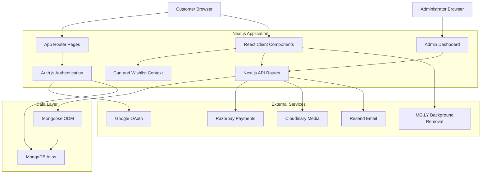
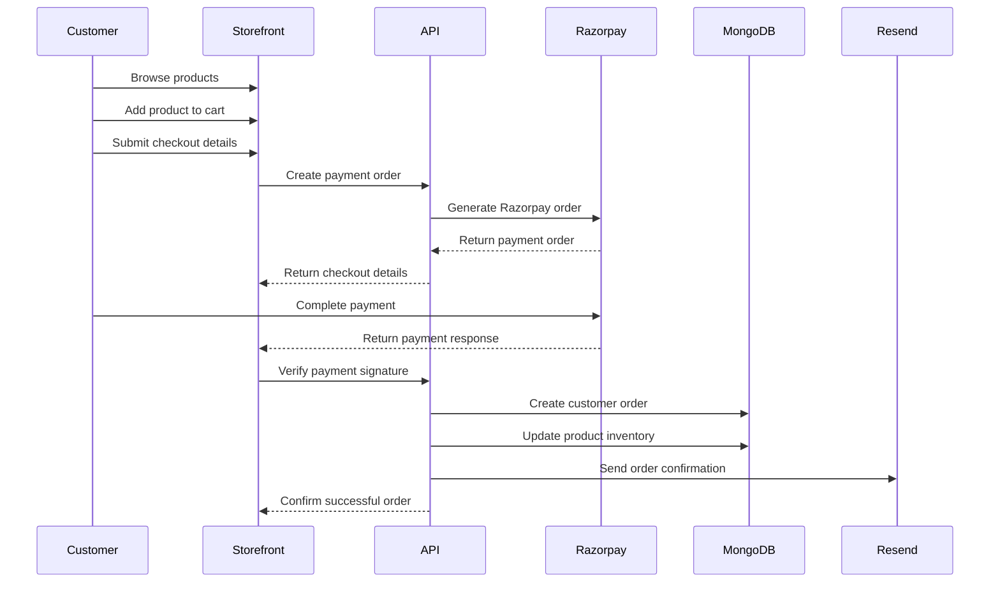
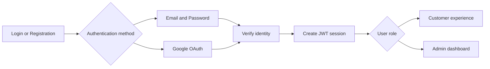

<div align="center">

# CALOTES VINTAGE

### Adapt. Stand Out. Be Calotes.

A production-oriented, full-stack e-commerce platform for curated pre-owned vintage clothing and streetwear in India.

[](https://calotes-gamma.vercel.app/)
[](https://github.com/ARPITPRAJAPATI/calotes)


</div>

---

## About Calotes

**Calotes Vintage** is a full-stack fashion commerce platform built for discovering and purchasing authentic pre-owned vintage clothing and streetwear.

The application combines a premium editorial storefront with essential commerce functionality, including product discovery, authentication, shopping cart management, wishlist support, online payments, order tracking, email notifications, inventory management, and a protected administration dashboard.

The platform also includes a distinctive **Fit Canvas** experience that allows users to experiment with outfit combinations using draggable clothing elements and browser-based background removal.

> Every garment has a story. Calotes helps you continue it.

---

## Live Application

**Storefront:** [calotes-gamma.vercel.app](https://calotes-gamma.vercel.app/)

**Source Code:** [github.com/ARPITPRAJAPATI/calotes](https://github.com/ARPITPRAJAPATI/calotes)

---

## Core Features

### Customer Experience

* Premium vintage and streetwear storefront
* Responsive mobile, tablet, and desktop layouts
* Product browsing by collection and category
* Detailed product pages
* Size, condition, brand, price, and measurement information
* Product filtering and sorting
* Featured and latest-arrival collections
* Persistent shopping cart
* Persistent wishlist
* Guest and authenticated checkout flows
* Promotional code support
* Razorpay payment integration
* Customer profile and order history
* Dark and light theme support
* Toast-based user feedback
* Lookbook and editorial brand pages
* Shipping, return, privacy, and terms pages

### Authentication

* Email and password registration
* Secure password hashing with `bcryptjs`
* Credentials-based authentication
* Google OAuth authentication
* JWT-based sessions
* Role-based customer and administrator access
* Protected administration routes
* Persistent authentication sessions

### Administration

* Protected administrator dashboard
* Product creation and editing
* Product image management
* Category management
* Inventory and stock management
* Order management
* Order status updates
* Payment status visibility
* Promotional code management
* Store configuration management
* Dashboard statistics and summaries

### Commerce and Payments

* Razorpay order creation
* Razorpay checkout integration
* Payment signature verification
* Order persistence in MongoDB
* Payment and fulfilment status tracking
* Stock reduction after successful payment
* Guest checkout support
* Order-confirmation email delivery

### Media and Creative Tools

* Cloudinary image hosting
* Multiple product images
* Image upload and transformation workflow
* Browser-based AI background removal
* Interactive Fit Canvas
* Drag-and-drop outfit composition
* Reusable cutout caching

### Communication

* Transactional email delivery through Resend
* Welcome emails
* Order confirmation emails
* Reusable HTML email templates
* Customer contact experience
* Instagram and WhatsApp integration

---

## Fit Canvas

The **Fit Canvas** is one of the platform's most distinctive features.

It allows customers to visually combine clothing pieces before purchasing them.

```text
Select products
      │
      ▼
Remove image backgrounds
      │
      ▼
Create transparent garment cutouts
      │
      ▼
Drag, move and layer items
      │
      ▼
Build a complete outfit composition
```

Background removal is performed in the browser using `@imgly/background-removal`, reducing the need for a separate AI-processing backend.

---

## System Architecture



---

## Application Flow

### Customer Purchase Flow



### Authentication Flow



---

## Technology Stack

| Layer              | Technology                |
| ------------------ | ------------------------- |
| Framework          | Next.js 16 App Router     |
| Frontend           | React 19                  |
| Language           | TypeScript                |
| Styling            | Tailwind CSS 4            |
| Animation          | Framer Motion             |
| Icons              | Lucide React              |
| Authentication     | Auth.js / NextAuth v5     |
| Password Security  | bcryptjs                  |
| Database           | MongoDB Atlas             |
| ODM                | Mongoose                  |
| Payments           | Razorpay                  |
| Image Hosting      | Cloudinary                |
| Background Removal | IMG.LY Background Removal |
| Email              | Resend                    |
| Validation         | Zod                       |
| Notifications      | React Hot Toast           |
| Deployment         | Vercel                    |
| Code Quality       | ESLint                    |

---

## Repository Structure

```text
calotes/
├── public/
│   └── Static assets and brand media
│
├── scratch/
│   └── Development and experimentation files
│
├── src/
│   ├── app/
│   │   ├── about/
│   │   ├── admin/
│   │   ├── api/
│   │   ├── canvas/
│   │   ├── checkout/
│   │   ├── contact/
│   │   ├── login/
│   │   ├── lookbook/
│   │   ├── privacy/
│   │   ├── product/
│   │   ├── profile/
│   │   ├── register/
│   │   ├── returns/
│   │   ├── shipping/
│   │   ├── shop/
│   │   ├── terms/
│   │   ├── globals.css
│   │   ├── layout.tsx
│   │   └── page.tsx
│   │
│   ├── components/
│   │   ├── Shared interface components
│   │   ├── Product components
│   │   ├── Cart and wishlist drawers
│   │   ├── Navigation and footer
│   │   └── Administrative components
│   │
│   ├── context/
│   │   ├── Cart state
│   │   └── Wishlist state
│   │
│   ├── lib/
│   │   ├── db.ts
│   │   ├── mongodb.ts
│   │   ├── cloudinary.ts
│   │   └── sendEmail.ts
│   │
│   ├── models/
│   │   ├── Product
│   │   ├── User
│   │   ├── Order
│   │   ├── Category
│   │   ├── Promo
│   │   └── Store settings
│   │
│   ├── types/
│   │   └── Shared TypeScript interfaces
│   │
│   ├── auth.config.ts
│   ├── auth.ts
│   └── proxy.ts
│
├── .gitignore
├── AGENTS.md
├── CLAUDE.md
├── CODE_OWNERSHIP_REPORT.md
├── DEPLOYMENT_CHECKLIST.md
├── eslint.config.mjs
├── next.config.ts
├── package.json
├── postcss.config.mjs
├── tsconfig.json
└── README.md
```

The structure may evolve as additional platform capabilities are introduced.

---

## Database Design

The application uses MongoDB with Mongoose models for persistent commerce data.

### Product

```text
Product
├── name
├── slug
├── description
├── price
├── compareAtPrice
├── images[]
├── category
├── brand
├── condition
├── sizes[]
├── stock
├── SKU
├── measurements
├── tags[]
├── featured status
└── publication status
```

### User

```text
User
├── name
├── email
├── hashed password
├── avatar
└── role
    ├── customer
    └── admin
```

### Order

```text
Order
├── customer reference
├── purchased items[]
├── shipping address
├── payment method
├── payment status
├── order status
├── totals
├── Razorpay references
└── timestamps
```

Additional models support:

* Product categories
* Promotional codes
* Store settings
* Authentication accounts and sessions

---

## Local Development

### Prerequisites

Install the following before running the project:

* Node.js 20 or later
* npm
* MongoDB Atlas account
* Google Cloud OAuth credentials
* Razorpay account
* Cloudinary account
* Resend account

### Clone the Repository

```bash
git clone https://github.com/ARPITPRAJAPATI/calotes.git
cd calotes
```

### Install Dependencies

```bash
npm install
```

### Configure Environment Variables

Create a `.env.local` file in the project root:

```env
# Database
MONGODB_URI=your_mongodb_connection_string

# Authentication
AUTH_SECRET=your_secure_auth_secret
NEXTAUTH_SECRET=your_secure_auth_secret
NEXTAUTH_URL=http://localhost:3000

# Google OAuth
GOOGLE_CLIENT_ID=your_google_client_id
GOOGLE_CLIENT_SECRET=your_google_client_secret

# Razorpay
RAZORPAY_KEY_ID=your_razorpay_key_id
RAZORPAY_KEY_SECRET=your_razorpay_key_secret
NEXT_PUBLIC_RAZORPAY_KEY_ID=your_public_razorpay_key

# Cloudinary
CLOUDINARY_CLOUD_NAME=your_cloudinary_cloud_name
CLOUDINARY_API_KEY=your_cloudinary_api_key
CLOUDINARY_API_SECRET=your_cloudinary_api_secret

# Email
RESEND_API_KEY=your_resend_api_key
```

Never commit `.env`, `.env.local`, API keys, secrets, database credentials, or private certificates.

### Start the Development Server

```bash
npm run dev
```

Open:

```text
http://localhost:3000
```

---

## Available Scripts

| Command         | Description                           |
| --------------- | ------------------------------------- |
| `npm run dev`   | Starts the development server         |
| `npm run build` | Creates an optimized production build |
| `npm run start` | Starts the production server          |
| `npm run lint`  | Runs ESLint checks                    |

---

## Production Build

Before deployment, verify the project locally:

```bash
npm run lint
npm run build
npm run start
```

A successful production build helps detect:

* TypeScript errors
* Invalid imports
* Missing environment variables
* Server and client component issues
* Unsupported runtime behaviour
* Deployment-specific failures

---

## Deployment

The application is designed for deployment on Vercel.

### Vercel Deployment Flow

```text
GitHub repository
       │
       ▼
Vercel project
       │
       ├── Install dependencies
       ├── Build Next.js application
       ├── Configure environment variables
       └── Deploy serverless application
               │
               ▼
        Production storefront
```

### Deployment Steps

1. Fork or clone this repository.
2. Import the repository into Vercel.
3. Select the Next.js framework preset.
4. Configure all required environment variables.
5. Deploy the project.
6. Add the production domain.
7. Update OAuth callback URLs.
8. Configure Razorpay production credentials.
9. verify authentication, payments, emails, images, and admin access.

### Google OAuth Redirect

For local development:

```text
http://localhost:3000/api/auth/callback/google
```

For production:

```text
https://your-domain.com/api/auth/callback/google
```

---

## Security Considerations

The application includes several security-focused practices:

* Password hashing through bcrypt
* JWT-based authentication
* Protected administrator routes
* Role-based authorization
* Payment signature verification
* Server-side secret management
* Environment-based configuration
* Request validation
* Basic rate-limiting support
* Bot and request filtering
* Schema validation
* Restricted administrative APIs

### Never Commit

```text
.env
.env.local
*.pem
*.key
MongoDB credentials
Razorpay secrets
Cloudinary secrets
Google OAuth secrets
Resend API keys
```

Before every push:

```bash
git status
git diff --cached
```

---

## Testing Checklist

### Storefront

* [ ] Homepage loads successfully
* [ ] Product collections render correctly
* [ ] Product filtering works
* [ ] Product sorting works
* [ ] Product pages load using valid slugs
* [ ] Responsive layouts work across screen sizes

### Authentication

* [ ] Customer registration succeeds
* [ ] Credentials login succeeds
* [ ] Google OAuth succeeds
* [ ] Sessions survive page reloads
* [ ] Unauthenticated users cannot access protected routes
* [ ] Non-admin users cannot access administrator pages

### Cart and Wishlist

* [ ] Cart items persist after refresh
* [ ] Wishlist items persist after refresh
* [ ] Quantity changes update totals
* [ ] Removing products updates the interface
* [ ] Out-of-stock products cannot be ordered incorrectly

### Checkout

* [ ] Shipping details validate correctly
* [ ] Razorpay order creation succeeds
* [ ] Payment verification succeeds
* [ ] Order is saved to MongoDB
* [ ] Product stock is updated
* [ ] Confirmation email is delivered

### Administration

* [ ] Products can be created
* [ ] Products can be updated
* [ ] Images upload successfully
* [ ] Orders appear in the dashboard
* [ ] Order statuses can be updated
* [ ] Categories can be managed
* [ ] Promotional codes can be managed

### Production

* [ ] Production environment variables are configured
* [ ] OAuth redirect URLs use the production domain
* [ ] MongoDB accepts production connections
* [ ] Cloudinary transformations work
* [ ] Transactional emails are delivered
* [ ] Sitemap is available
* [ ] Robots file is available
* [ ] No secrets are exposed in client bundles

---

## Engineering Highlights

* Full-stack implementation inside a single Next.js application
* Strong TypeScript usage across frontend and backend
* API route-based backend architecture
* MongoDB connection reuse for serverless environments
* Credentials and OAuth authentication in one system
* Role-based administrative access
* Integrated real-world payment workflow
* Cloud-hosted image pipeline
* Transactional email automation
* Persistent cart and wishlist state
* AI-assisted fashion styling experience
* Responsive, animated, brand-focused interface
* Production deployment through Vercel

---

## Current Architecture

```text
Frontend
  └── React Client Components
        ├── Storefront
        ├── Product discovery
        ├── Cart and wishlist
        ├── Checkout
        └── Fit Canvas

Backend
  └── Next.js Route Handlers
        ├── Authentication
        ├── Products
        ├── Orders
        ├── Payments
        ├── Categories
        ├── Promotions
        ├── Settings
        └── Email workflows

Data
  └── MongoDB Atlas
        └── Mongoose models

External Services
  ├── Razorpay
  ├── Cloudinary
  ├── Google OAuth
  ├── Resend
  └── IMG.LY
```

---

## Roadmap

* [ ] Add automated unit and integration testing
* [ ] Add Playwright end-to-end testing
* [ ] Improve server-side rendering for product pages
* [ ] Add database-backed cart synchronization
* [ ] Add database-backed wishlist synchronization
* [ ] Add product reviews and ratings
* [ ] Add shipment tracking
* [ ] Add customer address management
* [ ] Add abandoned-cart email automation
* [ ] Add low-stock alerts
* [ ] Add inventory reservation during payment
* [ ] Add structured application logging
* [ ] Add analytics and conversion tracking
* [ ] Add error monitoring
* [ ] Add CI/CD validation through GitHub Actions
* [ ] Add Docker support
* [ ] Add Kubernetes deployment manifests
* [ ] Add infrastructure provisioning through Terraform
* [ ] Add automated backups and disaster-recovery procedures
* [ ] Improve accessibility auditing
* [ ] Improve product-page SEO and metadata

---

## Brand Philosophy

Calotes is built around three principles:

```text
AUTHENTIC
Carefully selected pre-owned garments with character and history.

CURATED
A focused collection rather than an endless catalogue.

TIMELESS
Pieces designed to remain relevant beyond short-lived fashion cycles.
```

---

## Contribution

Contributions, improvements, and technical suggestions are welcome.

```bash
git checkout -b feature/your-feature
git add .
git commit -m "Add your feature"
git push origin feature/your-feature
```

Then open a pull request describing:

* What was changed
* Why the change was required
* How the change was tested
* Any screenshots or visual changes
* Any new environment variables or migrations

---

## Author

**Arpit Kumar Prajapati**

Marketing, technology, product development, and brand operations for Calotes Vintage.

[](https://github.com/ARPITPRAJAPATI)

---

## Disclaimer

Calotes Vintage is an independent vintage and pre-owned fashion platform.

All third-party brand names, trademarks, and product references belong to their respective owners. Their use is solely for product identification and descriptive purposes.

---

<div align="center">

### CALOTES VINTAGE

**Authentic. Curated. Timeless.**

[Explore the Store](https://calotes-gamma.vercel.app/) ·
[View the Repository](https://github.com/ARPITPRAJAPATI/calotes) ·
[Report an Issue](https://github.com/ARPITPRAJAPATI/calotes/issues)

<br />

Built with Next.js, TypeScript, MongoDB and a passion for vintage fashion.

</div>
