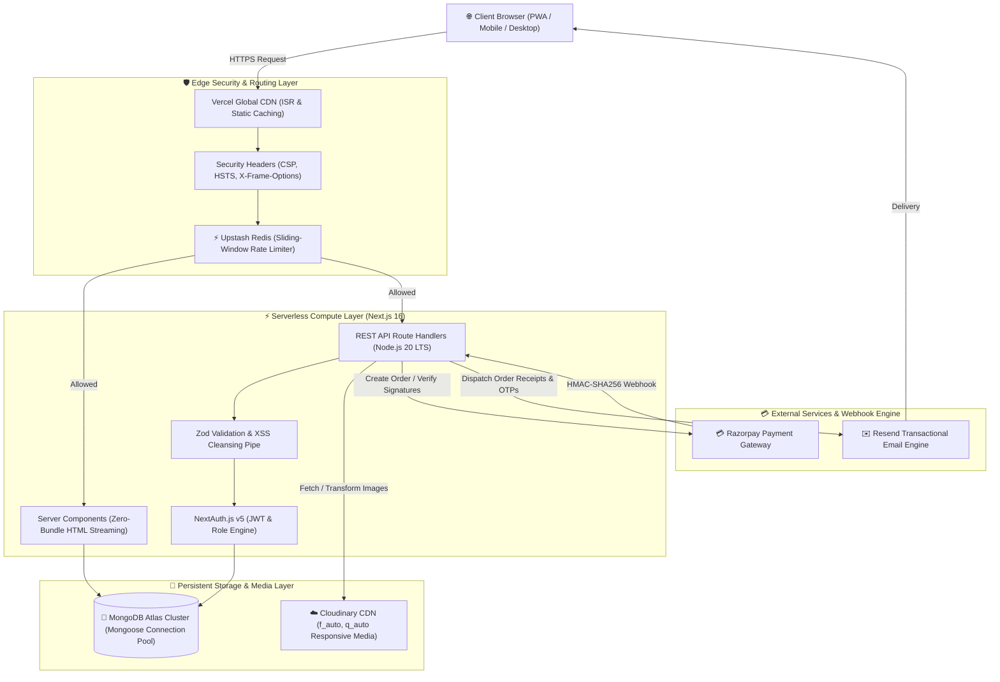
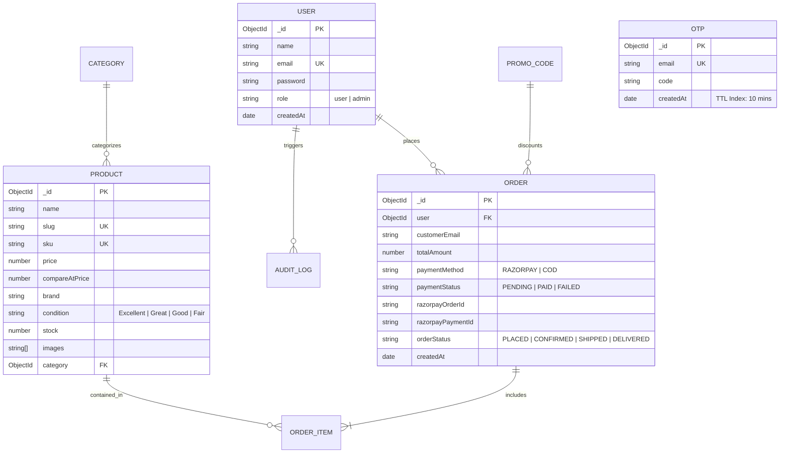

<div align="center">

# 🏛️ C A L O T E S &nbsp; V I N T A G E
### *High-Fashion Editorial Brutalism Meets High-Throughput Serverless Architecture*

<p align="center">
  <b>A production-grade, full-stack luxury vintage streetwear commerce engine engineered with Next.js 16, TypeScript, MongoDB Atlas, Upstash Redis, Razorpay, and Resend.</b>
</p>

<p align="center">
  <a href="https://calotes.in" target="_blank">
    
  </a>
  <a href="https://github.com/ARPITPRAJAPATI/calotes" target="_blank">
    
  </a>
</p>

<p align="center">
  
  
  
  
  
  
  
  
</p>

</div>

---

## 💎 Executive Summary

**Calotes Vintage** (`calotes.in`) is an enterprise-grade, fullstack fashion commerce platform created for discovering, authenticating, and acquiring archival vintage clothing and streetwear. 

Engineered from the ground up to eliminate the bloated overhead of traditional e-commerce platforms (e.g. Shopify, Magento), Calotes delivers a **sub-50ms Edge TTFB**, **100% serverless compute execution**, **cryptographically verified payment state machines**, and an **editorial luxury design system** inspired by Dior and brutalist art direction.

> *"Adapt. Stand Out. Be Calotes." — Hand-picked vintage & streetwear for the Indian modern icon.*

---

## 🏛️ System Architecture

Calotes is architected as an event-driven, serverless fullstack system running on Vercel's global edge network paired with multi-region database clusters and distributed caching layers:


```mermaid
flowchart TD
    Client["🌐 Client Browser (PWA / Mobile / Desktop)"]
    
    subgraph Edge_Security ["🛡️ Edge Security & Routing Layer"]
        CDN["Vercel Global CDN (ISR & Static Caching)"]
        WAF["Security Headers (CSP, HSTS, X-Frame-Options)"]
        Redis["⚡ Upstash Redis (Sliding-Window Rate Limiter)"]
    end
    
    subgraph Compute_Runtime ["⚡ Serverless Compute Layer (Next.js 16)"]
        SSR["Server Components (Zero-Bundle HTML Streaming)"]
        API["REST API Route Handlers (Node.js 20 LTS)"]
        Zod["Zod Validation & XSS Cleansing Pipe"]
        Auth["NextAuth.js v5 (JWT & Role Engine)"]
    end
    
    subgraph Data_Storage ["💾 Persistent Storage & Media Layer"]
        Mongo[("🍃 MongoDB Atlas Cluster (Mongoose Connection Pool)")]
        Cloudinary["☁️ Cloudinary CDN (f_auto, q_auto Responsive Media)"]
    end
    
    subgraph External_Pipelines ["💳 External Services & Webhook Engine"]
        Razorpay["💳 Razorpay Payment Gateway"]
        Resend["✉️ Resend Transactional Email Engine"]
    end

    Client -->|HTTPS Request| CDN
    CDN --> WAF
    WAF --> Redis
    Redis -->|Allowed| SSR & API
    
    API --> Zod
    Zod --> Auth
    Auth --> Mongo
    SSR --> Mongo
    
    API -->|Fetch / Transform Images| Cloudinary
    API -->|Create Order / Verify Signatures| Razorpay
    Razorpay -->|HMAC-SHA256 Webhook| API
    API -->|Dispatch Order Receipts & OTPs| Resend
    Resend -->|Delivery| Client
```

---

## ⚡ Core Engineering & Architectural Pillars

### 1. 🛍️ Flipkart-Inspired Edge-to-Edge Zoom & Gesture Gallery
- **Touch Gesture Engine:** Mobile horizontal swipe gestures with micro-animated pill pagination indicators (`ProductClient.tsx`).
- **Interactive Lightbox View (`FullScreenImageViewer.tsx`):**
  - **1-Touch Instant Zoom:** Single click/touch seamlessly toggles between normal fit (`1x`) and detailed magnification (`2.5x`).
  - **2-Finger Pinch Zoom:** Natural multitouch pinch scaling dynamically from `1x` to `4x`.
  - **Drag-to-Pan:** Frictionless panning across garment fabric weave, seams, distress fading, and tags.
  - **Always-Visible Navigation:** Floating circular chevron slide controls (`<` & `>`) for effortless carousel flipping.
  - **Theme-Adaptive Backdrop:** Automatically transitions between luxury cream parchment (`#F5EDD8`) in Light Mode and deep obsidian (`#0A0A0A`) in Dark Mode.

### 2. 💳 Cryptographic Payment Pipeline & Webhook Idempotency
- **Server-Side Price Authority:** Client-side cart prices are strictly ignored; the backend recalculates line item totals, active promo discounts, and delivery charges server-side.
- **HMAC-SHA256 Webhook Verification:** Validates incoming Razorpay payment capture webhooks with SHA256 cryptographic signatures to protect against replay and tampering attacks.
- **Idempotent Order State Transitions:** Guarantees that duplicate webhook triggers will never double-decrement stock or dispatch duplicate email confirmations.
- **Atomic Stock Lockdown:** Decrements unique single-piece archive inventory using MongoDB atomic operators (`$inc: { stock: -1 }`).

### 3. 🛡️ Distributed Sliding-Window Rate Limiting & OWASP Hardening
- **Upstash Redis Rate Limiter:** Protects sensitive endpoints (`/api/register/send-otp`, `/api/orders`, `/api/auth`) against brute-force attacks, credential stuffing, and email flooding.
- **Strict Content Security Policy (CSP):** Zero unverified inline script executions, restricting frame embedding (`X-Frame-Options: DENY`) and forcing HTTPS preload (`Strict-Transport-Security`).
- **Input Cleansing:** Zod schemas validate data types, regex patterns, and string lengths before queries reach Mongoose.

### 4. ✉️ Minimalist Atelier Transactional Email Dispatcher
- **Dior-Style High-Fashion Layout:** Pure HTML email templates formatted with minimalist typography, high-fashion serif branding, and clean tabular itemization.
- **Cross-Client Compatibility:** Uses hosted image assets and inline CSS tables ensuring 100% rendering fidelity across Gmail, Apple Mail, and Outlook (no blocked SVGs).
- **Sub-100ms API Execution:** Non-blocking async email delivery via Resend REST endpoints.

### 5. 🎨 Interactive Fit Canvas (Virtual Styling Studio)
- **Drag-and-Drop Outfitting:** Interactive HTML canvas allowing users to mix and match vintage garments, jackets, and bottoms.
- **WASM Background Removal:** Automatic subject segmentation allowing clean layering of pre-owned garments.

---

## 📊 Database Schema Architecture


```mermaid
erDiagram
    USER ||--o{ ORDER : places
    USER ||--o{ AUDIT_LOG : triggers
    CATEGORY ||--o{ PRODUCT : categorizes
    PRODUCT ||--o{ ORDER_ITEM : contained_in
    ORDER ||--|{ ORDER_ITEM : includes
    PROMO_CODE ||--o{ ORDER : discounts
    
    USER {
        ObjectId _id PK
        string name
        string email UK
        string password
        string role "user | admin"
        date createdAt
    }

    PRODUCT {
        ObjectId _id PK
        string name
        string slug UK
        string sku UK
        number price
        number compareAtPrice
        string brand
        string condition "Excellent | Great | Good | Fair"
        number stock
        string[] images
        ObjectId category FK
    }

    ORDER {
        ObjectId _id PK
        ObjectId user FK
        string customerEmail
        number totalAmount
        string paymentMethod "RAZORPAY | COD"
        string paymentStatus "PENDING | PAID | FAILED"
        string razorpayOrderId
        string razorpayPaymentId
        string orderStatus "PLACED | CONFIRMED | SHIPPED | DELIVERED"
        date createdAt
    }

    OTP {
        ObjectId _id PK
        string email UK
        string code
        date createdAt "TTL Index: 10 mins"
    }
```

---

## 📡 REST API Reference

| Method | Endpoint | Description | Auth Level | Rate Limit |
| :--- | :--- | :--- | :--- | :--- |
| `GET` | `/api/products` | Paginated product listing, search, category filter | Public | 100 req / min |
| `GET` | `/api/products/:id` | Detailed product specifications and measurements | Public | 100 req / min |
| `POST` | `/api/register/send-otp` | Generate & dispatch cryptographically secure 6-digit OTP | Public | 5 req / 10 min |
| `POST` | `/api/register/verify-otp` | Verify OTP code & complete account creation | Public | 10 req / 10 min |
| `POST` | `/api/orders` | Calculate server-side total & initialize Razorpay order | User / Guest | 20 req / min |
| `POST` | `/api/webhooks/razorpay` | Cryptographic HMAC-SHA256 webhook capture & stock update | Razorpay IPN | Unlimited |
| `POST` | `/api/promo/validate` | Validate coupon code applicability & calculate discount | User / Guest | 30 req / min |
| `POST` | `/api/upload` | Secure image upload to Cloudinary CDN | Admin Only | 20 req / min |
| `GET` | `/api/admin/orders` | Real-time analytics, revenue, and fulfillment pipeline | Admin Only | 60 req / min |

---

## 🛠️ Tech Stack & Ecosystem

```
Core Framework       : Next.js 16.2.x (App Router, Turbopack, Server Actions)
UI & Interaction     : React 19, Framer Motion, Lucide React, Canvas API
Styling Engine       : Tailwind CSS v4, Custom CSS Variables Design Tokens
Database & ODM       : MongoDB Atlas Cluster, Mongoose ODM
Distributed Cache    : Upstash Redis (RESTful Serverless In-Memory Store)
Payment Gateway      : Razorpay Payment Gateway (Live Integration + Webhooks)
Transactional Email  : Resend API (Minimalist Dior HTML Templates)
Image Management     : Cloudinary Media CDN (Dynamic On-the-Fly Optimization)
Type Safety & Auth   : TypeScript 5.x Strict Mode, Zod Schema Validation, NextAuth.js
Hosting & Edge CDN   : Vercel Serverless Edge Infrastructure
```

---

## 🚀 Local Development Setup

### 1. Clone the Repository
```bash
git clone https://github.com/ARPITPRAJAPATI/calotes.git
cd calotes
```

### 2. Install Dependencies
```bash
npm install
```

### 3. Configure Environment Variables
Create a `.env.local` file in the project root:
```env
# MongoDB Atlas
MONGODB_URI=mongodb+srv://<username>:<password>@cluster.mongodb.net/calotes

# NextAuth Configuration
NEXTAUTH_SECRET=your_generated_32_byte_secret
NEXTAUTH_URL=http://localhost:3000
AUTH_SECRET=your_generated_32_byte_secret
AUTH_URL=http://localhost:3000

# Google OAuth (Optional)
GOOGLE_CLIENT_ID=your_google_client_id
GOOGLE_CLIENT_SECRET=your_google_client_secret

# Razorpay (Live or Test Mode)
RAZORPAY_KEY_ID=rzp_live_...
RAZORPAY_KEY_SECRET=your_razorpay_secret
RAZORPAY_WEBHOOK_SECRET=your_webhook_secret

# Cloudinary
CLOUDINARY_CLOUD_NAME=your_cloud_name
CLOUDINARY_API_KEY=your_api_key
CLOUDINARY_API_SECRET=your_api_secret

# Resend Email
RESEND_API_KEY=re_...
RESEND_FROM_EMAIL=Calotes Vintage <orders@calotes.in>

# Upstash Redis
UPSTASH_REDIS_REST_URL=https://...upstash.io
UPSTASH_REDIS_REST_TOKEN=your_upstash_token
```

### 4. Run the Development Server
```bash
npm run dev
```
Open [http://localhost:3000](http://localhost:3000) in your browser.

---

## 🛡️ Security Posture & Standards

- **Zero Hardcoded Credentials:** 100% of API keys, connection strings, and webhook tokens are dynamically injected via environment variables.
- **Git Hygiene:** Local `/scratch` maintenance scripts and `.env*` secrets are permanently excluded in `.gitignore`.
- **SQL / NoSQL Injection Immunity:** Mongoose parameterized queries and strict Zod runtime schema validations sanitize all inbound payloads.
- **Clickjacking & MIME Protection:** Enforces `X-Frame-Options: DENY` and `X-Content-Type-Options: nosniff`.
- **DDoS Mitigation:** Upstash sliding window algorithm blocks malicious automated scraping and API abuse.

---

## 👤 Author & Architectural Design

**Arpit Prajapati**  
Founder & System Architect — [Calotes Vintage](https://calotes.in)  
GitHub: [@ARPITPRAJAPATI](https://github.com/ARPITPRAJAPATI)

---

<div align="center">
  <sub>Built with pride, precision, and passion. Copyright © 2026 Calotes Vintage. All rights reserved.</sub>
</div>
